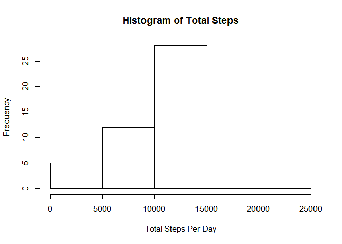
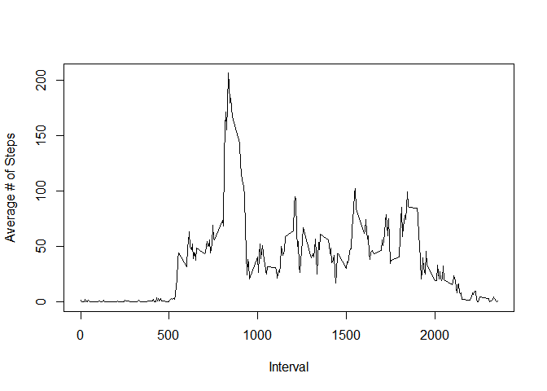
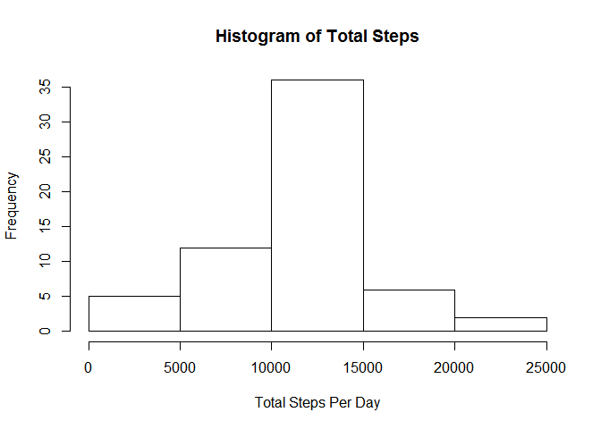
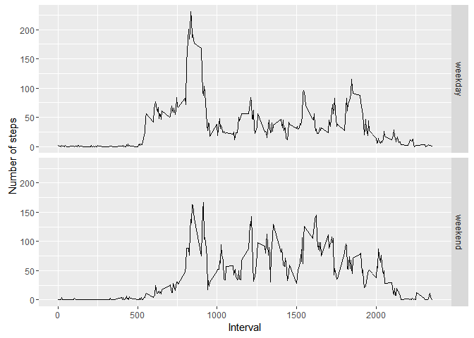

# Reproducible Research: Peer Assessment 1


# Reproducible Research
## Peer-graded Assignment: Course Project 1 Submission  
### Author - Jayesh Samant

The below document provides the R code that was used to generate the output along with the output for the Course Project 1 Submission.  

#### Loading and preprocessing data
The below code loads the required libraries and the data from the source files. On reading the data, it converts the date column from Character to Date type. 


```r
## Load the required libraries
library(reshape2)
library(ggplot2)
## Download and unzip the data file
#address <- "https://d396qusza40orc.cloudfront.net/repdata%2Fdata%2Factivity.zip"
#download.file(address, "data.zip")
#unzip("data.zip")
## Read and Process the Data File
activity <- read.csv("activity.csv")
activity$date <- as.Date(activity$date)
```

#### What is the mean total number of steps taken per day?
The below code calculates the total number of steps taken per day and then displays a histogram of the same.

```r
## Determine the total number of steps taken per day
totalSteps <- tapply(activity$steps, activity$date, sum)
## Display a histogram of the total number of steps taken each day
hist(totalSteps, xlab = "Total Steps Per Day", main = "Histogram of Total Steps")
```

<!-- -->


Mean of Total Steps taken per day is **10766**.  
Median of Total Steps taken per day **10765**.  

#### What is the average daily activity pattern?
The below code calculates the average number of steps in each 5-minute interval by ignoring the NA values. It then displays a time-series plot of the 5-min interval and the average number of steps taken, averaged across all days.

```r
## Determine the average number of steps per interval
intervalSteps <- tapply(activity$steps, activity$interval, mean, na.rm = TRUE)
## Plot the average number of steps per interval
plot(names(intervalSteps), intervalSteps, type = "l", xlab = "Interval", ylab = "Average # of Steps")
```

<!-- -->

On average across all days in the dataset, the **835**th 5-minute interval contains the maximum number of steps.

#### Imputing missing values
The total number of missing values in the dataset is **2304**  
To fill the missing values, the mean for that 5-minute interval is used as the proxy. The below code shows how the imputed dataset is created.

```r
## Create a new dataset
imputed <- activity
## If a value is na, replace that value in the new dataset with the average of the number of steps in that 5-min interval
for(i in 1:nrow(imputed))
{
  if(is.na(imputed[i, ]$steps))
  {
    imputed[i, ]$steps <- intervalSteps[as.character(imputed[i, ]$interval)]
  }
}
```
The below code creates a histogram of the imputed values.

```r
totalImpSteps <- tapply(imputed$steps, imputed$date, sum)
hist(totalImpSteps, xlab = "Total Steps Per Day", main = "Histogram of Total Steps")
```

<!-- -->

Mean of Total Steps taken per day is **10766**.  
Median of Total Steps taken per day is **10766**
There is not much impact on the mean and median of the data post imputation.

#### Are there differences between activity patterns between weekdays and weekends?
The below code identifies if there are differences between the activity pattern for weekdays and weekends.

```r
## Create a new factor variable indicating if the day is a weekend or weekday
imputed$day <- "weekend"
for(i in 1:nrow(imputed))
{
  if(weekdays(imputed[i, ]$date) == "Sunday")
  {
    imputed[i, ]$day <- "weekend"
  }
  else if(weekdays(imputed[i, ]$date) == "Saturday")
  {
    imputed[i, ]$day <- "weekend"
  }
  else
  {
    imputed[i, ]$day <- "weekday"
  }
}
imputed$day <- factor(imputed$day)
## Prepare the data for the plot
sumData <- tapply(imputed$steps, list(imputed$interval, imputed$day), mean)
sumData <- melt(sumData)
## Plot the data
qplot(Var1, value, data = sumData, facets = Var2 ~ ., ylab = "Number of steps", xlab = "Interval", geom = c("line"))
```

<!-- -->


From the plots above there seems to be a visible difference between the activity patterns on weekends and weekdays. The subject is more evenly active on weekends.
